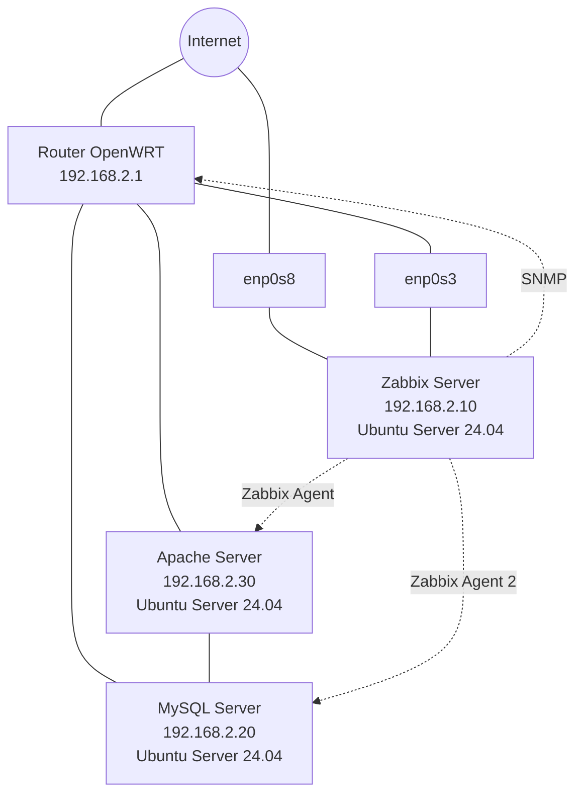

# Proyecto Final ASIR - Sistema de Monitorización con Zabbix

## 🧑‍💻 Descripción del Proyecto

Este proyecto consiste en la implementación de un sistema de **monitorización de infraestructura IT** utilizando **Zabbix** en un entorno virtualizado y controlado.

El objetivo es supervisar el estado de distintos servidores y servicios críticos mediante el uso de **agentes de Zabbix**, **SNMP** y **scripts personalizados en Bash**, generando alertas automáticas cuando se detecta algún problema.

La infraestructura se encuentra desplegada en **máquinas virtuales** que simulan un entorno real de red empresarial.

---

## 🎯 Objetivos del Proyecto

- Implementar un **sistema profesional de monitorización**
- Aprender a utilizar **Zabbix en entornos reales**
- Automatizar comprobaciones mediante **scripts Bash**
- Integrar **alertas automáticas por correo**
- Simular una **infraestructura empresarial monitorizada**

---

## 🛠️ Arquitectura del Sistema

El entorno se compone de **4 máquinas virtuales**:

| Máquina | Sistema | Función | IP |
|------|------|------|------|
| Zabbix Server | Ubuntu Server 24.04 | Servidor de monitorización | 192.168.2.10 |
| Apache Server | Ubuntu Server 24.04 | Servidor web | 192.168.2.30 |
| MySQL Server | Ubuntu Server 24.04 | Servidor de base de datos | 192.168.2.20 |
| Router | OpenWRT | Salida a Internet / Gateway | 192.168.2.1 |

---

## 🛜 Infraestructura de Red

Red interna utilizada: 192.168.2.0/24

Configuración de red:

- **Router OpenWRT**
  - Adaptador 1 → Red interna
  - Adaptador 2 → Adaptador puente (salida a Internet)

Este router actúa como **gateway** para el resto de máquinas del laboratorio.

---
## 🌐 Diagrama de Arquitectura

## 💻 Tecnologías Utilizadas

- **Zabbix**
- **Ubuntu Server 24.04**
- **Apache2**
- **MySQL / MariaDB**
- **OpenWRT**
- **SNMP**
- **Bash**
- **SMTP (envío de alertas por correo)**
- **VirtualBox**

---

## 👁️ Monitorización Implementada

### Monitorización mediante Agentes Zabbix

Se utilizan **agentes de Zabbix** instalados en los servidores Ubuntu para monitorizar:

- Estado del sistema
- Uso de CPU
- Uso de memoria
- Espacio en disco
- Estado de servicios

---

### Monitorización mediante SNMP

El router **OpenWRT** es monitorizado mediante **SNMP**, permitiendo obtener información sobre:

- Estado de la red
- Disponibilidad del dispositivo
- Métricas de funcionamiento

---

## Alertas Personalizadas de Monitorización

Además de las plantillas estándar de Zabbix, se han desarrollado **scripts en Bash y alertas personalizadas** para realizar comprobaciones específicas.

Alertas implementadas:

### 1️⃣ Estado de Base de Datos

Comprueba si una **base de datos específica en MySQL** se encuentra disponible.

### 2️⃣ Estado de Página Web

Verifica que una **página web concreta del servidor Apache** esté disponible mediante el uso de curl.

### 3️⃣ Ping hacia el exterior

Comprueba la conectividad desde el servidor hacia el **router (salida a Internet)**.

### 4️⃣ Ping hacia la red interna

Verifica la conectividad del router dentro de la **red local**.

### 5️⃣ Integridad de archivos web

Comprueba que el archivo index de la página web de apache se encuentre siempre en el directorio correspondiente.

### 6️⃣ Estado del servicio Apache

Verifica que el servicio esté activo y funcionando.

### 7️⃣ Estado del servicio MySQL

Verifica que el servicio se encuentre en ejecución.

---

## ⚠️ Sistema de Alertas

Se han configurado **triggers personalizados en Zabbix** que se activan cuando se detecta un problema en el sistema monitorizado.

Cuando ocurre un incidente:

1. Se genera un **trigger en Zabbix**
2. Se envía un **correo electrónico automático**
3. El correo incluye un **mensaje personalizado en HTML**

Ejemplo de notificaciones:

### 🔴 Problema detectado
Notificación enviada cuando se detecta un fallo en:

- Servicio Apache
- Servicio MySQL
- Base de datos
- Página web
- Conectividad de red
- Integridad de archivos

### 🟢 Problema resuelto
Cuando el sistema vuelve a su estado normal, se envía otro correo indicando que el problema inicial ya ha sido resuelto y devuelve el último valor registrado.

---

## 🧑‍🤝‍🧑 Autores

**Proyecto realizado por:**

- Aarón Pérez Ramírez

- Iván Díaz Farto

**Proyecto Final del ciclo formativo:**

Administración de Sistemas Informáticos en Red (ASIR)
